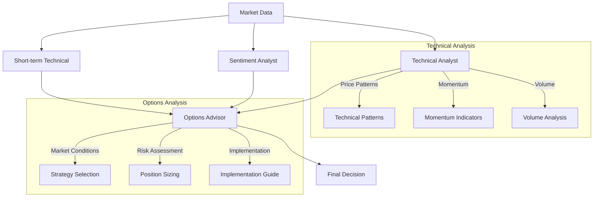

# Free US Investment Agent System 🚀

A sophisticated AI-powered investment analysis system for US stocks, providing comprehensive technical analysis, options strategies, and trading recommendations.

## ✨ Key Features

### 1. Intelligent Multi-Agent Analysis

- **Technical Analysis Agent**

  - Advanced price pattern recognition
  - Dynamic support/resistance detection using ATR
  - Volume profile analysis with accumulation/distribution patterns
  - Enhanced momentum calculations using Rate of Change (ROC)

- **Short-term Technical Agent**

  - Real-time momentum tracking with improved RSI calculation
  - Volatility-based price targets
  - Dynamic support/resistance levels
  - Volume momentum analysis

- **Options Advisor Agent**

  - Strategy selection based on market conditions
  - Risk-adjusted position sizing
  - Multi-timeframe expiration analysis
  - Premium and strike optimization

- **Sentiment Analysis Agent**

  - News sentiment integration
  - Market sentiment tracking
  - Social media sentiment analysis

- **Risk Management Agent**
  - Integrated risk assessment
  - Position sizing recommendations
  - Stop-loss optimization
  - Portfolio exposure analysis

### 2. Enhanced Technical Analysis

- **Momentum Analysis**

  - Rate of Change (ROC) calculations
  - Enhanced RSI with edge case handling
  - Volume momentum tracking
  - MACD and signal line analysis

- **Price Level Analysis**

  - ATR-based support/resistance levels
  - Dynamic price targets
  - Volatility-adjusted ranges
  - Trend strength indicators

- **Volume Analysis**
  - Accumulation/distribution patterns
  - Volume profile assessment
  - Volume-price relationship analysis
  - Liquidity analysis

### 3. Sophisticated Options Strategy Engine

- **Strategy Selection**

  - Market condition-based recommendations
  - Volatility regime analysis
  - Risk-reward optimization
  - Multi-leg strategy support

- **Implementation Details**

  - Conservative/Moderate/Aggressive approaches
  - Multiple expiration timeframes
  - Strike price optimization
  - Premium and profit targets

- **Risk Management**
  - Maximum loss calculations
  - Position sizing guidelines
  - Rolling recommendations
  - Adjustment triggers

### 4. Modern Interactive Interface

- **Analysis Display**

  - Comprehensive tooltips for all metrics
  - Color-coded signals (bullish/bearish/neutral)
  - Clear hierarchical information structure
  - Interactive charts and visualizations

- **Trading Insights**

  - Agent-specific analysis display
  - Confidence levels for all signals
  - Detailed reasoning explanations
  - Risk assessment visualization

- **User Experience**
  - Hover-over explanations for technical terms
  - Smooth tooltip animations
  - Clean, organized layout
  - Real-time updates

## 🏗️ System Architecture

The system employs a sophisticated multi-agent workflow:



## 🚀 Usage

1. **Start the Application**

```bash
python src/app.py
```

2. **Access the Web Interface**

- Open your browser and navigate to `http://localhost:5001`
- Enter a stock ticker (e.g., AAPL, NVDA)
- Set the analysis date and number of news articles to analyze
- Click "Analyze" to start the analysis

3. **Interpret the Results**

- Review the Long-term Analysis section for overall market position
- Check the Short-term Momentum Analysis for immediate trading signals
- Examine the Options Strategy section for detailed trading recommendations
- Review the Analysis Reasoning for comprehensive insights

## 📋 Prerequisites

- Python 3.11+
- Web browser for accessing the interface
- Internet connection for market data access
- AlphaVantage API key (Get your free API key from [AlphaVantage](https://www.alphavantage.co/support/#api-key))
  - Note: Free API key has a limit of 25 requests per day for news data
- Gemini API key (Get your free API key from [Google AI Studio](https://aistudio.google.com/))

## ⚠️ Disclaimer

This project is for **educational and research purposes only**.

- Not intended for real trading or investment decisions
- No warranties or guarantees provided
- Past performance does not indicate future results
- Consult a financial advisor for investment decisions

## 🔧 Installation

1. Clone the repository:

```bash
git clone [repository-url]
cd Free_US_Investment_Agent_System
```

2. Install dependencies:

```bash
pip install -r requirements.txt
```

3. Set up your environment variables:

```bash
# Create and edit .env file with your API keys
cp .env.example .env
```

Edit the .env file:

```
ALPHA_VANTAGE_API_KEY=your_api_key_here
GEMINI_API_KEY=your_gemini_api_key_here
GEMINI_MODEL=gemini-1.5-flash
```

4. Start the application:

```bash
python src/app.py
```

## 📊 Example Output

The system provides:

- Technical analysis with momentum indicators
- Support and resistance levels
- Options strategy recommendations
- Risk assessment and position sizing
- Detailed implementation guidelines

## 🤝 Contributing

Contributions are welcome! Please feel free to submit pull requests, create issues, or suggest improvements.

## 🙏 Acknowledgements

This project builds upon concepts and ideas from several excellent open-source projects:

- [ai-hedge-fund](https://github.com/virattt/ai-hedge-fund.git) - Original AI-powered trading system
- [FREE_US_INVESTMENT_AGENT_SYSTEM](https://github.com/24mlight/Free_US_Investment_Agent_System) - Enhanced trading system with options support
- yfinance for market data integration
- Various technical analysis libraries and frameworks

We sincerely thank the original authors for their excellent work and inspiration.

## 📝 License

This project is licensed under the MIT License - see the LICENSE file for details.
